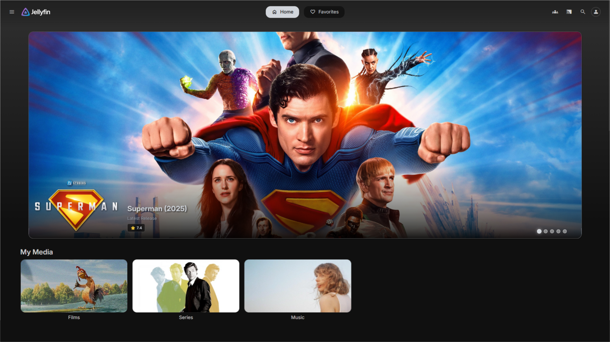
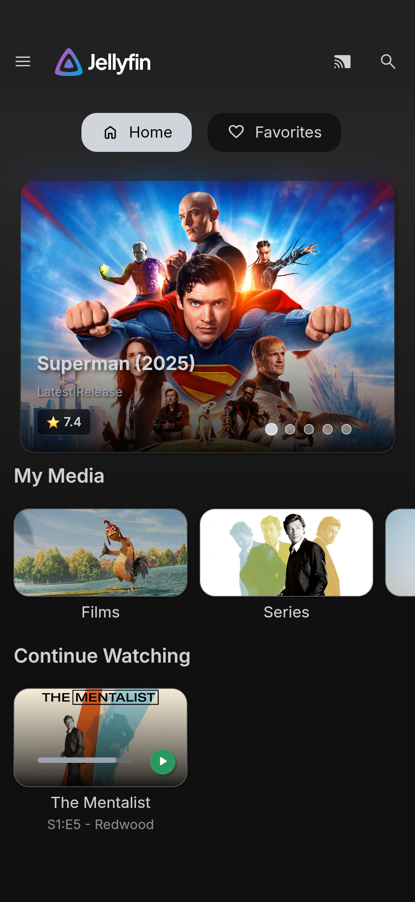

# Jellyfeatured

Adds a featured section to the home screen of your Jellyfin server.

## Installation
This plugin is made for Jellyfin `v10.11.4`

* Add `https://raw.githubusercontent.com/21513/Jellyfeatured/main/manifest.json` to your plugin repository list in the Jellyfin dashboard.
* Find Jellyfeatured in the plugin catalog and install it.
* Restart your Jellyfin server.
* Go to the plugin settings page to configure your featured items.
* Sometimes you have to force refresh your web interface to see the changes: `Ctrl + Shift + R`

