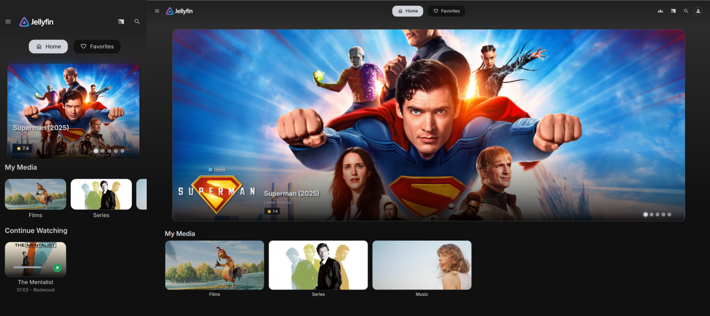

# Jellyfeatured

#### This plugin is currently in development. Not everything is working as intended.

Adds a featured section to your Jellyfin home screen with automatic recommendations. Modify or reorder categories to fit your preferences.

Works on both desktop and mobile devices. Does not work on the Android TV client or clients that don't support web injections.

Clients tested:
- Jellyfin Media Player (Windows)
- Mobile and tablet apps (Android)
- Desktop web browsers (Chrome, Edge, Firefox)
- Mobile web browsers (Chrome, Firefox)

I need your help testing on more clients! Please open an issue if you find any bugs or compatibility problems.

## Features
- Automatic Recommendations
- Customizable Categories
- Responsive Design
- ElegantFin Theme Support
- Auto-Refresh

## Requirements
- Jellyfin Server v10.11.4 or higher
- Modern web browser with JavaScript enabled

## Installation
This plugin is made for Jellyfin `v10.11.4`

1. Add `https://raw.githubusercontent.com/21513/Jellyfeatured/main/manifest.json` to your plugin repository list in the Jellyfin dashboard.
2. Find Jellyfeatured in the plugin catalog and install it.
3. Restart your Jellyfin server.
4. Go to the plugin settings page to configure your featured items.
5. Sometimes you have to force refresh your web interface to see the changes: `Ctrl + Shift + R`

## Configuration

Access the configuration page through **Dashboard > Plugins > Jellyfeatured > Settings**.