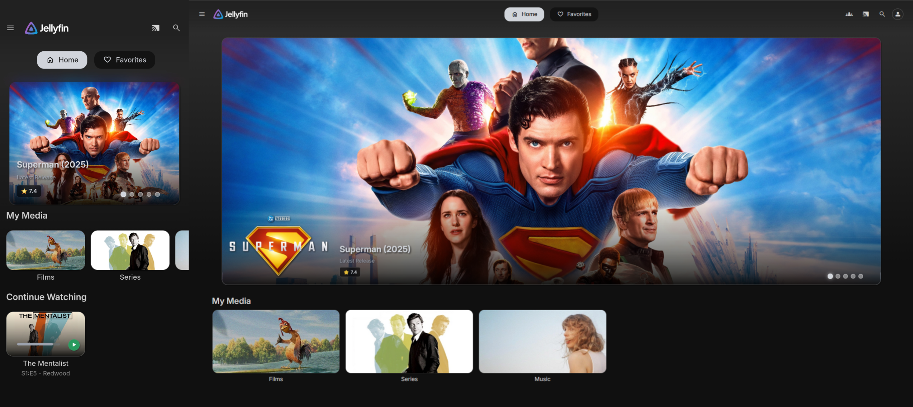

# Jellyfeatured

[](https://github.com/21513/Jellyfeatured/releases)
[](https://jellyfin.org/)
[](LICENSE)
[](https://github.com/21513/Jellyfeatured/releases)

#### I do not always have time to fix bugs or add features. If you want me to update this, contact me or consider sponsoring this project.

Adds a featured section to your Jellyfin home page with automatic recommendations. Modify or reorder categories to fit your preferences.


Works on both desktop and mobile devices. Does not work on the Android TV client or clients that don't support web injections.

Clients tested:
- Jellyfin Media Player (Windows)
- Mobile and tablet apps (Android)
- Desktop web browsers (Chrome, Edge, Firefox)
- Mobile web browsers (Chrome, Firefox)



I need your help testing on more clients! Please open an issue if you find any bugs or compatibility problems.

## Features
- Automatic Recommendations
- Responsive Design
- ElegantFin Theme Support

Features that will be added in the future:
- Auto-refresh
- ~~Customizable category order~~
- ~~Additional categories~~
- ~~Randomized featured items~~
- ~~Refresh interval settings~~

## Requirements
- Jellyfin Server v10.11.8
- Modern web browser with JavaScript enabled

## Installation
This plugin is made for Jellyfin `v10.11.8`

1. Add the following link to your plugin repository list in the Jellyfin dashboard:
    ```
    https://baeac.xyz/jellyfin/plugins/manifest.json
    ```

    Or add this link for the latest development version (unstable):
    ```
    https://raw.githubusercontent.com/21513/Jellyfeatured/main/manifest.json
    ```

2. Find Jellyfeatured in the plugin catalog and install it.
3. Restart your Jellyfin server.
4. Sometimes you have to force refresh your web interface to see the changes: `Ctrl + Shift + R`

## Configuration

Access the configuration page through **Dashboard > Jellyfeatured**. You can enable or disable categories, or change the order they appear in. You can also add a custom admin pick by searching for the title you want to feature.